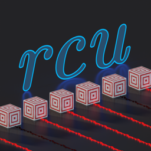

# Redstone Computer Utilities

>  Lightweight and Modular Redstone Computer Debugging Tools.

[English README](./README.md) | [简体中文简介](./README.zh_cn.md)

## Highlights

- Empowers programs in any programming language (as long as it supports JSON and TCP) to debug redstone computers
  - Specially, [a Python library](https://github.com/NKID00/redstone-computer-utilities-python) is provided to facilitate development
- Supports redstone wires in any sizes and shapes from horizontal, vertical to even diagonal ones
- Completions and suggestions for every argument of all commands
- Server-side-only implementation, fully compatible with vanilla clients
- Compatibility with tick speed controlling, stepping and pausing implemented by other mods
- Built-in English and Simplified Chinese translations

## Installation

This mod supports Minecraft 1.16-1.19.3 and requires Java 17, the latest Fabric Loader and the latest Fabric API.

Only server-side installation is required for multiplayer and client-side installation is required for singleplayer.

## Basic Usage

1. Execute `/rcu` to receive a wand item (or pick a pink dye by yourself).
2. Attach target blocks to redstone wires of your redstone mechanics to be debugged.
3. Left click with the wand item to select the most significant bit, right click to select the least significant bit.
4. Execute `/rcu new <interface name>` to create an interface.
5. Write debugging program and wrap it as a script.
6. Start up the script.
7. Execute `/rcu run <script name> <interface name>` to run the script.

You may also accelerate tick speed if it takes too long.

See [docs/Details.md](./docs/Details.md) for details.

## Development

To build the mod, Java 17 or newer is required,

```sh
./gradlew build
```

Built jars are in `build/libs/`.

To extract translation keys, Java and GNU gettext are required,

```sh
./gradlew extract
```

Extracted translation keys are located in `build/messages.po`. Translations are hosted on [transifex](https://www.transifex.com/nkid00/redstone-computer-utilities).

To convert translations to or from Minecraft-compatible json format,

```sh
python po2minecraft.py path/to/messages.po path/to/messages.json
python minecraft2po.py path/to/messages.json path/to/messages.po
```

## Credits

- [Fabric Loader](https://github.com/FabricMC/fabric-loader), distributed under [Apache-2.0](https://github.com/FabricMC/fabric-loader/blob/master/LICENSE).
- [Fabric API](https://github.com/FabricMC/fabric), distributed under [Apache-2.0](https://github.com/FabricMC/fabric/blob/master/LICENSE).
- [GSON](https://github.com/google/gson), distributed under [Apache-2.0](https://github.com/google/gson/blob/master/LICENSE).
- [netty](https://github.com/netty/netty), distributed under [Apache-2.0](https://github.com/netty/netty/blob/4.1/LICENSE.txt).
- [Guava](https://github.com/google/guava), distributed under [Apache-2.0](https://github.com/google/guava/blob/master/COPYING).

## Copyright

Copyright © 2021-2023 NKID00

Distributed under [MPL-2.0](./LICENSE).
